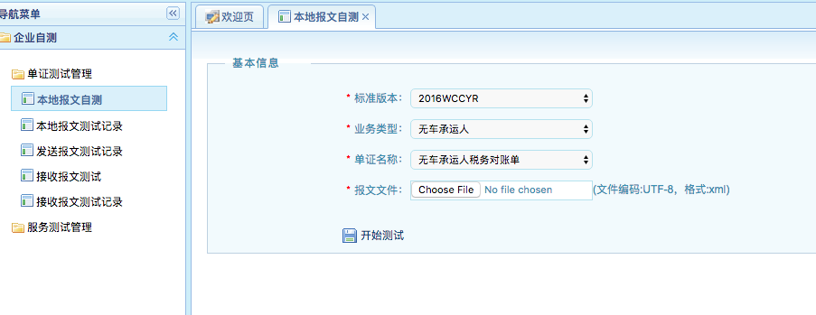
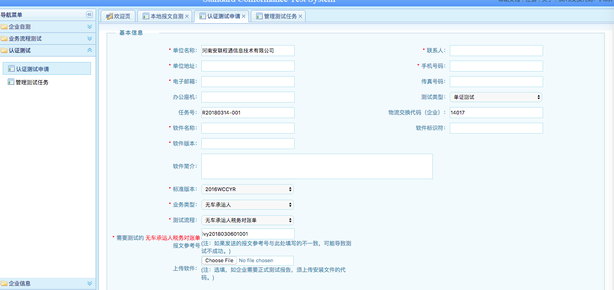

# 国家交通运输物流公共信息平台集成指南

注：以下简称“国家交通运输物流公共信息平台”为“信息平台”

## 步骤一： 注册信息平台账号，并完成企业的身份认证，详细注册步骤请参考信息平台官网（www.logink.org）注册流程。

注册完成后，请将信息平台登陆ID以下面格式发送到邮箱：jun.liu@alct56.com

#### 邮件标题：国家交通运输物流公共信息平台集成账号：{登陆ID} - {企业名称}，比如：

* 国家交通运输物流公共信息平台集成账号：19512 - 安联程通

## 步骤二： 申请数据交换服务 

登录控制台后，在菜单“平台服务 -> 数据交换“下可以申请数据交换服务。

* 请注意：由于各个交换服务器之间不能相互通讯，请申请3号浙江交换服务器

## 步骤三： 在完成集成之前，需要在信息平台完成符合性测试

登陆控制台后，在菜单“平台服务 -> 符合性测试”下完成符合性测试。在本项目中，信息平台定义的文档名称为税务对账单，详细步骤如下：

### 1.  税务对账单的符合性测试

* 登录测试系统
http://newscts.logink.org/scts/

### 2.  企业自测
* 选择菜单：企业自测 -> 单证测试管理 ->本地报文自测

* 填写信息，并上传报文

### 3.  认证测试申请
* 选择菜单：认证测试 -> 认证测试申请

注意:

- 标准版本，业务类型，测试流程，如果不能选择，请信息平台工作人员协助
- 参考报文号，需要与xml中的MessageReferenceNumber的value一致
  
### 4.  发送测试报文验证是否符合标准

报文接口和测试地址，请参照：http://www.logink.org/col/col2092/index.html 推荐使用webservice协议

可以使用程序，或者开发工具，如postman来发送报文。

报文发送后，需要信息平台工作人员协助查看数据是否符合标准

## 步骤四： 符合性测试通过后，发送正式运单到信息平台

正式接口地址，请参照： http://www.logink.org/col/col2092/index.html 推荐使用3号服务器，地址为： https://exb.logink.org/cuteinfo/services/ExchangeTransportService?wsdl

* 请务必注意：报文的发送参数“ToAddress”的参数值必须填写“19512”，否则无法接受报文。

